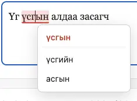

# Монгол зөв бичих · Mongolian Spell Checker (Chrome extension)

A Chrome extension that underlines misspelled **Mongolian (Cyrillic)** words
directly in text fields on any website and offers one-click corrections. Runs
**fully offline** using a Hunspell dictionary (~605,000 word forms) compiled to
WebAssembly.

### ▶️ [Try the live demo](https://temuulennibno.github.io/mongolian-grammar-checker/) (no install needed)




## What it does

- **Inline checking on any page** – focus a `<textarea>`, a text `<input>`, or
  a `contenteditable` editor (Gmail, social posts, rich text boxes), type
  Mongolian, and misspelled words get a red highlight. Click a flagged
  word to see suggestions and apply a fix.
- **Popup quick-checker** – click the toolbar icon to paste text and check it
  in a dedicated editor.
- **Right-click selection** – select Mongolian text on a page, right-click →
  *Монгол алдаа шалгах* to count errors and open them in the popup.

## What it does *not* do

- This is a **spelling / typo** checker, not a full grammar checker. Hunspell
  validates words (and their inflected forms) in isolation; it does not analyse
  sentence structure, agreement, or word order.

## Try it with no install (web demo)

**Live demo:** <https://temuulennibno.github.io/mongolian-grammar-checker/>

The `demo/` folder runs the **exact same** engine and checker code in a normal
web page, using a tiny `chrome.*` shim, so you can see the whole process without
loading an extension. To run it locally instead:

```bash
npm install
npm run demo:serve     # builds demo/ and serves it at http://localhost:8000
```

Open <http://localhost:8000>, wait for the status to read **Бэлэн** (a few
seconds while the dictionary loads), then type Mongolian in any of the three
pre-filled fields (textarea, contenteditable, input). Misspelled words get a red
highlight; click one to pick a correction.

## Install (developer / unpacked)

```bash
npm install
npm run prepare-dist   # generates icons + builds dist/sw.js and dist/content.js
```

Then in Chrome:

1. Open `chrome://extensions`.
2. Enable **Developer mode** (top right).
3. Click **Load unpacked** and select this project folder.
4. Pin the extension and open any page with a text box to try it.

## Package for the Chrome Web Store

```bash
npm run package        # builds + writes web-store.zip (upload this)
```

## How it works

```
content.js  ──port──►  sw.js (service worker)  ──►  hunspell-asm (WASM)
  scans fields            hosts the engine,            spell() / suggest()
  draws underlines        loads dict once,             over mn_MN.aff/.dic
  applies fixes           caches results
```

- The service worker loads the 17 MB dictionary once (~0.5 s) and keeps it
  warm while a field is focused via a long-lived port, so checks are instant.
- For `<textarea>` / `<input>`, the overlay is a transparent "mirror" div
  aligned over the field. For `contenteditable`, each misspelled word is located
  with a DOM `Range` and underlined at the rectangles from `getClientRects()`.
  Either way the user's own text is never altered until they apply a suggestion.

## Project layout

| Path | Purpose |
|------|---------|
| `manifest.json` | MV3 manifest (CSP allows `wasm-unsafe-eval`) |
| `src/sw.js` | Service-worker engine (bundled → `dist/sw.js`) |
| `src/content.js` | Inline field checker (bundled → `dist/content.js`) |
| `src/content.css` | Highlight + suggestion-tooltip styles |
| `popup/` | Toolbar popup quick-checker |
| `dict/` | `mn_MN.aff` + `mn_MN.dic` from [dict-mn](https://github.com/bataak/dict-mn) |
| `build.mjs` | esbuild bundling (forces CJS `main` to avoid a nanoid bug) |
| `generate-icons.mjs` | Generates `icons/*.png` |
| `test/` | Standalone browser harness used to verify the WASM engine |

## Roadmap

- Per-site enable/disable and a personal "ignore words" list.

## Credits

- **Dictionary**: the Mongolian Hunspell data (`mn_MN.aff` / `mn_MN.dic`) comes
  from the [**dict-mn**](https://github.com/bataak/dict-mn) project by Batmunkh
  Dorjgotov. Huge thanks to that project, which makes offline Mongolian
  spell-checking possible. Please consider starring and supporting it.
- **Engine**: [`hunspell-asm`](https://github.com/kwonoj/hunspell-asm) (Hunspell
  compiled to WebAssembly).

## License

- Extension code: **MIT** (see [`LICENSE`](LICENSE)).
- Dictionary data in `dict/`: **LPPL-1.3c**, from
  [dict-mn](https://github.com/bataak/dict-mn) (see [`dict/LICENSE`](dict/LICENSE)).
  The bundled `mn_MN.aff` / `mn_MN.dic` retain that license and their original
  copyright notices.
