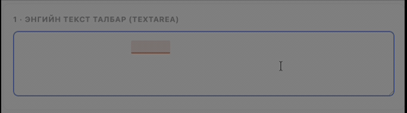

# Монгол зөв бичих · Mongolian Spell Checker (Chrome өргөтгөл)

[English](README.md) | **Монгол**

Аливаа вэб сайтын текст талбарт буруу бичигдсэн **монгол (кирилл)** үгсийг
шууд тодруулж, нэг товшилтоор засах боломж олгодог Chrome өргөтгөл. ~605,000
үгийн хэлбэр агуулсан Hunspell толийг WebAssembly болгон хөрвүүлсэн тул
**бүрэн офлайн** ажиллана.

### ▶️ [Шууд туршиж үзэх](https://temuulennibno.github.io/mongolian-grammar-checker/) (суулгах шаардлагагүй) · 📥 [Суулгах заавар](INSTALL.mn.md) · [Хувилбарууд](https://github.com/temuulennibno/mongolian-grammar-checker/releases)



[](https://github.com/temuulennibno/mongolian-grammar-checker/actions/workflows/ci.yml)


## Юу хийдэг вэ

- **Аль ч хуудсан дээр шууд шалгах** – `<textarea>`, текст `<input>`, эсвэл
  `contenteditable` засварлагч (Gmail, олон нийтийн сүлжээний бичвэр, баялаг
  текст талбар) дээр монголоор бичихэд буруу үгс улаанаар тодруулагдана.
  Тодруулсан үг дээр дарж саналуудаас зөвийг нь сонгож засна.
- **Попап шалгагч** – хэрэгслийн самбар дахь дүрс дээр дарж, бичвэрээ хуулж
  тусдаа засварлагч дотор шалгана.
- **Хулганы баруун товч** – хуудсан дээрх монгол бичвэрийг тэмдэглээд баруун
  товч → *Монгол алдаа шалгах* гэж сонгоно.
- **Хувийн толь** – тодруулсан үг дээр *＋ Толинд нэмэх* дарж, тухайн үгийг
  хаана ч зөв гэж тооцуулна. Жагсаалтыг попапаас удирдана.
- **Асаах/унтраах** – попапаас шалгалтыг бүх сайтад буюу тухайн сайтад
  түр унтраана (код бичдэг талбар зэрэгт тохиромжтой).

## Юу хийдэггүй вэ

- Энэ нь **зөв бичгийн (typo)** шалгагч бөгөөд бүрэн хэмжээний дүрмийн шалгагч
  биш. Hunspell нь үгсийг (болон тэдгээрийн нөхцөлт хэлбэрийг) тус тусад нь
  шалгадаг ба өгүүлбэрийн бүтэц, үг хоорондын зохицол, дарааллыг шинжилдэггүй.

## Суулгахгүйгээр туршиж үзэх (вэб демо)

**Шууд демо:** <https://temuulennibno.github.io/mongolian-grammar-checker/>

`demo/` фолдер нь өргөтгөлийг суулгахгүйгээр бүх үйл явцыг харуулахын тулд
энгийн вэб хуудсан дотор **яг адил** хөдөлгүүр болон шалгагч кодыг жижиг
`chrome.*` давхаргын тусламжтайгаар ажиллуулдаг. Локалаар ажиллуулах бол:

```bash
npm install
npm run demo:serve     # demo/-г бэлдээд http://localhost:8000 дээр ажиллуулна
```

<http://localhost:8000>-г нээгээд төлөв **Бэлэн** болохыг хүлээнэ үү (толь
ачаалахад хэдэн секунд зарцуулна), дараа нь гурван талбарын аль нэгэнд (textarea,
contenteditable, input) монголоор бичнэ. Буруу үгс улаанаар тодруулагдах ба үг
дээр дарж залруулга сонгоно.

## Суулгах (хөгжүүлэгч / unpacked)

```bash
npm install
npm run prepare-dist   # дүрс үүсгээд dist/sw.js, dist/content.js-г бэлдэнэ
```

Дараа нь Chrome дээр:

1. `chrome://extensions`-г нээнэ.
2. **Developer mode**-г асаана (баруун дээд буланд).
3. **Load unpacked** дарж энэ төслийн фолдерыг сонгоно.
4. Өргөтгөлийг хэрэгслийн самбарт бэхлээд текст талбартай хуудас нээж туршина.

> Дэлгэрэнгүй заавар: [INSTALL.mn.md](INSTALL.mn.md).

## Chrome Web Store-д зориулж багцлах

```bash
npm run package        # web-store.zip-г бэлдэнэ (үүнийг байршуулна)
```

## Хэрхэн ажилладаг вэ

```
content.js  ──port──►  sw.js (service worker)  ──►  hunspell-asm (WASM)
  талбар уншина          хөдөлгүүрийг хадгална        spell() / suggest()
  доогуур зурна          толийг нэг л удаа ачаална     mn_MN.aff/.dic дээр
  засварыг хэрэгжүүлнэ    үр дүнг кэшлэнэ
```

- Service worker нь 17 MB толийг нэг удаа (~0.5 сек) ачаалаад, талбар идэвхтэй
  байх хугацаанд урт хугацааны портоор дамжуулан санах ойд барьдаг тул
  шалгалт шуурхай явагдана.
- `<textarea>` / `<input>`-ийн хувьд талбарын дээр тааруулсан ил тод "толин"
  давхарга ашиглана. `contenteditable`-ийн хувьд буруу үг бүрийг DOM `Range`-ээр
  олж, `getClientRects()`-ийн өгсөн тэгш өнцөгтүүд дээр тодруулна. Аль ч
  тохиолдолд хэрэглэгчийн бичвэрийг засвар хэрэгжүүлэх хүртэл өөрчлөхгүй.

## Төслийн бүтэц

| Зам | Зориулалт |
|------|---------|
| `manifest.json` | MV3 manifest (CSP нь `wasm-unsafe-eval`-г зөвшөөрнө) |
| `src/sw.js` | Service-worker хөдөлгүүр (→ `dist/sw.js`) |
| `src/content.js` | Талбар доторх шалгагч (→ `dist/content.js`) |
| `src/content.css` | Тодруулга + саналын цонхны загвар |
| `popup/` | Хэрэгслийн самбар дахь попап шалгагч |
| `dict/` | [dict-mn](https://github.com/bataak/dict-mn)-ийн `mn_MN.aff` + `mn_MN.dic` |
| `build.mjs` | esbuild багцлалт (nanoid алдаанаас зайлсхийхээр CJS `main` ашиглана) |
| `generate-icons.mjs` | `icons/*.png` үүсгэгч |
| `test/` | WASM хөдөлгүүрийг шалгах бие даасан browser harness |

## Цаашдын төлөвлөгөө

- Chrome Web Store дээр нийтлэх болон Firefox хувилбар.
- Хэрэглэгчдийн нэмсэн үгийн хэлбэрүүдээр буруу тодруулгыг багасгах.

## Талархал

- **Толь**: монгол Hunspell өгөгдөл (`mn_MN.aff` / `mn_MN.dic`) нь Батмөнх
  Доржготовын [**dict-mn**](https://github.com/bataak/dict-mn) төслөөс гаралтай.
  Офлайн монгол зөв бичгийн шалгалтыг боломжтой болгосон тэр төсөлд маш их
  баярлалаа. Тэдний төслийг од (star) өгч дэмжихийг хүсье.
- **Хөдөлгүүр**: [`hunspell-asm`](https://github.com/kwonoj/hunspell-asm)
  (WebAssembly болгон хөрвүүлсэн Hunspell).

## Лиценз

- Өргөтгөлийн код: **MIT** ([`LICENSE`](LICENSE)-г үзнэ үү).
- `dict/` доторх толийн өгөгдөл: **LPPL-1.3c**,
  [dict-mn](https://github.com/bataak/dict-mn)-ээс ([`dict/LICENSE`](dict/LICENSE)).
  Багцалсан `mn_MN.aff` / `mn_MN.dic` нь уг лиценз болон анхны зохиогчийн эрхийн
  мэдэгдлээ хадгална.
